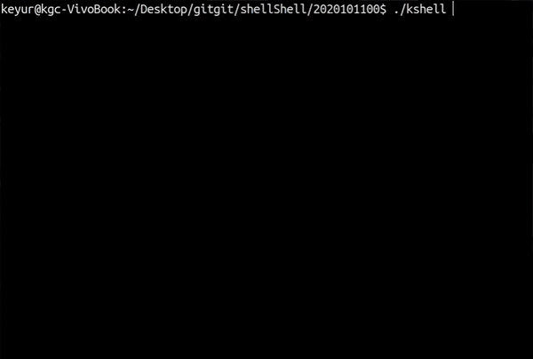

# C-Shell
A shell in C language which supports most functionalities of a Unix shell like I/O redirection, piping, job control etc.

    

## Division of Code:  
* ``headers.h`` contains function declaration for all functions. 
* The other files have the code for implementing the tasks suggested by the name of the files.
* The code starts executing from main.c from where all other functionalities are performed.

## Assumptions:  
* The history will be displayed for maximum 20 latest commands.  
* At max 100 commands will be given in one line.  
* Each command is less than 100 characters.  
* All paths involved are less than 1000 characters.  
* History is stored in ``txt`` file in the same folder as where the executable is stored.

## Features:  
* Builtin commands - {cd,pwd,echo}.  
* ls command - implemented various flags including -a - l.  
* System commands with and without arguments.  
* Foreground: process waits until the commands get executed.  
* Background: process doesn't wait for system commands get executed.  
* Upon completion of background, a completion message is prompted.  
* Repeat command to repeat a command multiple times.  
* pinfo command to display process information.  
* jobs: it displays information of the currently running background processes  
* sig: it kills a background process
* fg: it brings a background process to foreground and runs it
* bg: it stops a running background process.

## How to run the shell:  
* The makefile will compile the code.  
* Enter ``make`` command to compile the code.  
* The shell can be executed by running the ``kshell`` executable.  
* ./kshell to run the program. 

## Redirection and piping:
* Redirection and piping functionality has been added in the input.c file
* In this file, the redirections of inputs and outputs have been handled.
* Piping of commands is also implemented in the same file.

## Signal Handling:  
* <kbd>ctrl</kbd> + <kbd>c</kbd> : terminates any running foreground process
* <kbd>ctrl</kbd> + <kbd>z</kbd> : sends a foreground process to background and changes its state from running to stopped.
* <kbd>ctrl</kbd> + <kbd>d</kbd> : terminates the shell.